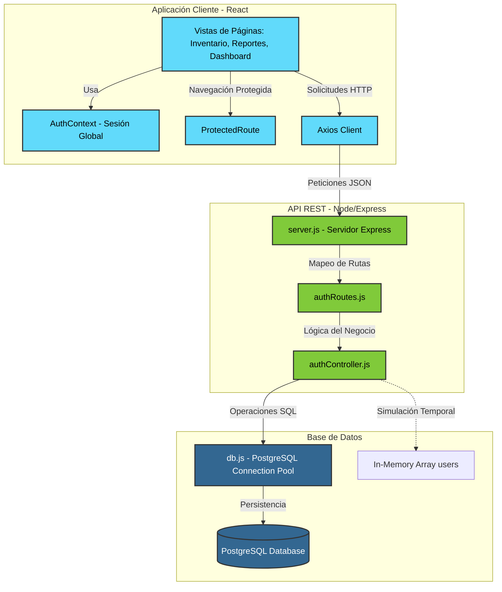

# 📦 StockFlow — Sistema Profesional de Gestión de Inventario

<p align="center">
  
  
  
  
</p>

---

## 📝 Descripción

**StockFlow** es una plataforma web full-stack premium y moderna diseñada para revolucionar la forma en que las empresas gestionan, controlan y reportan sus activos e inventarios en tiempo real. Utilizando una arquitectura moderna y desacoplada, StockFlow ofrece un flujo de trabajo optimizado que reduce al mínimo el margen de error humano mediante un robusto control de accesos basado en roles (RBAC) y una interfaz de usuario fluida y reactiva.

---

## 🛑 El Problema que Resuelve

En el entorno corporativo e industrial, la administración manual de activos (laptops, periféricos, repuestos) en hojas de cálculo tradicionales o software obsoleto genera:
*   **Falta de visibilidad y control:** Desconocimiento sobre el estado exacto de los dispositivos ("Activo", "En reparación", "De baja").
*   **Riesgos de seguridad y auditoría:** Modificaciones de stock no autorizadas o sin trazabilidad.
*   **Ineficiencias operativas:** Los directivos no cuentan con métricas agregadas al instante, mientras que el personal técnico pierde tiempo valioso en procesos de registro complejos.

**StockFlow** unifica estos mundos en una sola herramienta web de alto rendimiento. Ofrece paneles especializados para cada nivel de la organización, permitiendo que la información fluya desde el registro básico en almacén hasta los reportes ejecutivos del nivel directivo.

---

## 🗺️ Estructura Ideal del Proyecto

El proyecto sigue un enfoque monorepo organizado y desacoplado, lo que facilita el desarrollo independiente del frontend y el backend, así como la inclusión de documentación y recursos de video explicativos:

```text
StockFlow/
├── backend/                  # Servidor de API RESTful (Node.js + Express)
│   ├── config/               # Configuraciones del sistema (Conexión BD, etc.)
│   │   └── db.js             # Conexión configurada para PostgreSQL
│   ├── controllers/          # Lógica de negocio (Controladores MVC)
│   │   └── authController.js # Manejo de registro y login (Simulado & DB-Ready)
│   ├── routes/               # Definición de end-points de la API
│   │   └── authRoutes.js     # Rutas de autenticación (/register, /login)
│   ├── .gitignore            # Archivos excluidos de Git para el backend
│   ├── package.json          # Dependencias y scripts del backend
│   └── server.js             # Punto de entrada principal de la API Express
├── frontend/                 # Aplicación de Cliente Web (React 19 + Vite)
│   ├── components/           # Componentes UI reutilizables
│   │   └── ProtectedRoute.jsx# Guardia de rutas según estado de sesión
│   ├── context/              # Manejadores de Estado Global
│   │   └── authContext.jsx   # Contexto global de sesión y roles de usuario
│   ├── pages/                # Vistas principales del sistema (Páginas)
│   │   ├── Dashboard.jsx     # Panel interactivo segmentado por roles
│   │   ├── Inventario.jsx    # Visualización y alta interactiva de stock
│   │   ├── Login.jsx         # Pantalla de ingreso y selección de rol
│   │   ├── Perfil.jsx        # Gestión del perfil de usuario y seguridad
│   │   ├── Reportes.jsx      # Generación de descargas e informes
│   │   └── Usuarios.jsx      # Administración de usuarios (Exclusivo Jefe)
│   ├── public/               # Recursos estáticos públicos (Logos, iconos)
│   ├── src/                  # Estilos principales e inicializadores de React
│   │   ├── App.css           # Estilos de diseño del layout principal
│   │   ├── App.jsx           # Enrutamiento principal (React Router Dom)
│   │   ├── index.css         # Reset global y variables de diseño CSS
│   │   └── main.tsx          # Inicializador de la aplicación
│   ├── package.json          # Dependencias y scripts del frontend
│   ├── tsconfig.json         # Configuración del compilador TypeScript
│   └── vite.config.ts        # Configuración de compilación ultrarrápida con Vite
├── documentacion/            # Manuales, especificaciones e históricos de pruebas
│   └── Pruebas_API.pdf       # Documentación de pruebas y respuestas de endpoints
├── video/                    # Demos grabadas y material visual de la plataforma
├── kotlin.txt                # Información y metadatos de autoría del proyecto
└── README.md                 # Guía maestra del proyecto (Este archivo)
```

---

## 🛠️ Tecnologías Utilizadas

La suite tecnológica de StockFlow ha sido cuidadosamente seleccionada para garantizar alta velocidad en desarrollo, escalabilidad y un mantenimiento sumamente sencillo:

### **Frontend**
*   **React 19 (SPA):** La versión más moderna de la biblioteca de UI por excelencia, garantizando un renderizado ultra veloz.
*   **TypeScript:** Añade tipado estático fuerte para evitar errores en producción y facilitar el refactor.
*   **Vite:** El motor de construcción y servidor de desarrollo moderno más rápido y ligero.
*   **React Router Dom (v7):** Enrutamiento avanzado de páginas con soporte nativo para layouts y protección de rutas.
*   **Axios:** Cliente HTTP optimizado para la comunicación asíncrona con el backend REST.
*   **Vanilla CSS:** Estilos fluidos y a la medida sin sobrecarga de bibliotecas de terceros.

### **Backend & Base de Datos**
*   **Node.js:** Entorno de ejecución de alto rendimiento basado en eventos.
*   **Express.js (v5):** Framework web minimalista e ideal para construir APIs REST sólidas de forma modular.
*   **PostgreSQL:** Base de datos relacional robusta elegida para la persistencia segura de relaciones complejas de stock.
*   **dotenv:** Gestión segura de variables de entorno (credenciales, puertos, URLs).
*   **Nodemon:** Servidor de desarrollo con recarga en caliente automática.

---

## 📐 Arquitectura del Sistema

StockFlow emplea una arquitectura **de tres capas (Cliente-Servidor-Base de Datos)** con un flujo desacoplado que garantiza la mantenibilidad:



*   **Seguridad:** Las peticiones al servidor se aíslan de las rutas desprotegidas en el frontend a través del componente `<ProtectedRoute>`, permitiendo el paso únicamente a usuarios con sesión activa.
*   **Modularidad MVC:** El backend separa sus responsabilidades de forma que cada endpoint (`route`) delega directamente el procesamiento en un controlador especializado (`controller`), protegiendo la conexión directa con PostgreSQL a través de un pool optimizado (`db.js`).

---

## ✨ Features Destacadas

### 👥 1. Roles y Accesos Segmentados (RBAC)
La interfaz del **Dashboard** se adapta dinámicamente según el nivel del usuario autenticado:
*   **👑 Jefe:** Acceso estratégico total. Capacidad exclusiva para ingresar al módulo de **Gestión de Usuarios** (`/usuarios`) y visualizar métricas críticas financieras del negocio.
*   **🛡️ Supervisor:** Interfaz enfocada en la monitorización y supervisión. Posee facultades para auditar el movimiento de stock sin intervenir directamente en la operación física diaria.
*   **🔧 Técnico:** Vista operativa simplificada de alto rendimiento. Optimizado para búsquedas rápidas, actualización ágil del estado de equipos e inserción directa de stock.

### 📦 2. Módulo de Inventario Dinámico
*   Registro instantáneo de equipos con identificadores únicos (ID), nombres descriptivos y estados actualizables en caliente ("Activo", "En reparación").
*   Filtros dinámicos y persistencia en memoria durante la sesión.

### 📊 3. Generación y Exportación de Reportes
*   Módulo preparado para exportación directa de informes con soporte para acciones en un solo clic:
    *   `Generar PDF` (Exportación en formato de impresión y entrega formal).
    *   `Exportar Excel` (Hojas de cálculo listas para análisis de datos masivo).

---

## 💼 Casos de Uso del Sistema

1.  **Auditoría de Activos TI en una Corporación:**
    El *Jefe* de TI ingresa y ve en su panel cuántos equipos están actualmente en stock o averiados. El *Técnico* de soporte en sitio cambia el estado de una laptop a "En reparación" en segundos tras una falla. El *Supervisor* audita la actividad al final de la jornada.
2.  **Control de Entradas y Salidas en Bodega:**
    Personal técnico en almacén usa la interfaz desde tabletas para agregar nuevos lotes de productos periféricos que acaban de llegar, manteniendo el sistema actualizado en tiempo real.
3.  **Generación de Informes de Stock para Dirección:**
    A final de mes, el supervisor genera reportes consolidados en formato PDF o Excel de manera inmediata desde el módulo `/reportes` para presentarlo ante la junta directiva.

---

## 🚀 Guía de Instalación y Despliegue

Sigue estos pasos para levantar el entorno de desarrollo local tanto para el servidor como para el cliente:

### ⚙️ Prerrequisitos
Tener instalado en el equipo:
*   [Node.js](https://nodejs.org/) (Versión 18 o superior recomendada).
*   [PostgreSQL](https://www.postgresql.org/) (Para conectar la base de datos).

---

### 🖥️ 1. Configuración del Backend

1.  Abre una terminal y colócate en la carpeta del backend:
    ```bash
    cd backend
    ```
2.  Instala todas las dependencias del servidor:
    ```bash
    npm install
    ```
    *Nota: Si vas a usar la conexión a PostgreSQL de forma inmediata, puedes instalar el driver nativo ejecutando:*
    ```bash
    npm install pg
    ```
3.  Configura las variables de entorno creando un archivo `.env` en la raíz de la carpeta `backend/`:
    ```env
    PORT=3000
    DB_USER=tu_usuario_postgres
    DB_HOST=localhost
    DB_NAME=stockflow
    DB_PASSWORD=tu_contraseña
    DB_PORT=5432
    ```
4.  Inicia el servidor en modo desarrollo (con recarga automática mediante Nodemon):
    ```bash
    npm run dev
    ```
    *El servidor estará corriendo en:* `http://localhost:3000`

---

### 🎨 2. Configuración del Frontend

1.  Abre otra terminal y dirígete al directorio frontend:
    ```bash
    cd frontend
    ```
2.  Instala las dependencias del cliente React:
    ```bash
    npm install
    ```
3.  Inicia el servidor de desarrollo local de Vite:
    ```bash
    npm run dev
    ```
4.  Abre tu navegador e ingresa a la dirección indicada por la consola:
    *Por lo general:* `http://localhost:5173`

---

## 🎯 Roadmap de Desarrollo (Línea de Tiempo)

El desarrollo del proyecto está estructurado en hitos incrementales diseñados para consolidar la robustez del sistema:

### **Fase 1: Prototipado y Estructura (Completado) ✅**
- [x] Configuración de la estructura monorepo básica y árbol de directorios.
- [x] Maquetado estático de vistas en React (Dashboard, Inventario, Login, Usuarios, Reportes).
- [x] Implementación de sesión simulada en memoria mediante `AuthContext` y `ProtectedRoute`.
- [x] Creación del servidor Express modular con endpoints `/login` y `/register` de prueba.

### **Fase 2: Conectividad y Persistencia Real (En Desarrollo) ⚙️**
- [ ] Cableado del controlador `authController.js` con la base de datos PostgreSQL utilizando `config/db.js`.
- [ ] Encriptación de contraseñas en el backend utilizando `bcrypt` o `argon2`.
- [ ] Implementación de intercambio de Tokens JWT para autenticación stateless segura.

### **Fase 3: CRUD Completo y Operaciones (Corto Plazo) 🚀**
- [ ] Creación de tablas de base de datos para Activos (`items`), Roles y Logs de Auditoría.
- [ ] Funcionalidad interactiva completa en la página `/inventario` para Agregar, Editar y Dar de baja equipos reales.
- [ ] Restricción de endpoints del backend según el rol extraído del JWT (seguridad por API).

### **Fase 4: Exportación Real de Documentos (Mediano Plazo) 📄**
- [ ] Integración de `jsPDF` en el frontend para descargas reales de reportes en PDF.
- [ ] Integración de exportadores a archivos `.xlsx` (Excel) desde el módulo de reportes.
- [ ] Dockerización completa del sistema utilizando un archivo `docker-compose.yml` para levantar PostgreSQL, el Backend y el Frontend con un solo comando.

### **Fase 5: Extensión Mobile (Largo Plazo) 📱**
- [ ] Desarrollo de una aplicación móvil nativa en **Kotlin** para Android para técnicos de almacén, permitiendo el escaneo de códigos de barra y códigos QR de los equipos para inventario ultra veloz en sitio.

---

## 👥 Autor y Contacto

Este proyecto está desarrollado y liderado por:

*   **Desarrollador:** Camilo Vera
*   **Correo de contacto:** cvera24@soy.sena.edu.co
*   **Institución:** SENA (Servicio Nacional de Aprendizaje)

---
<p align="center">Desarrollado profesionalmente para la eficiencia y optimización operativa de activos. StockFlow © 2026.</p>
